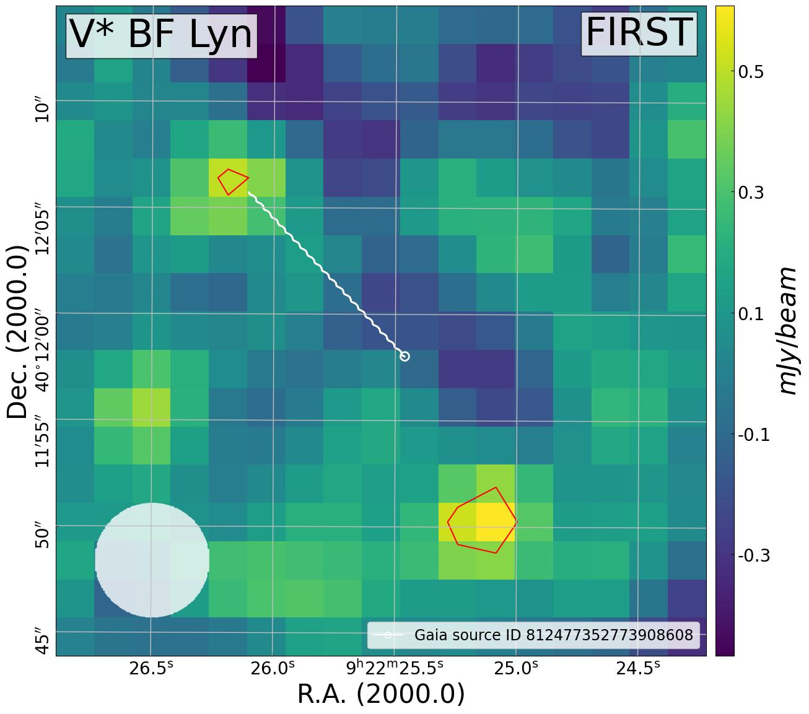
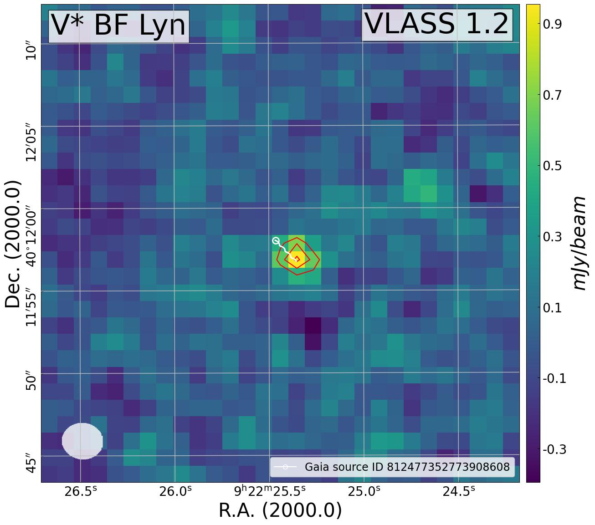

# Radio Star Identification Using the "Image Method"

This repository contains the code and methodology to identify radio-emitting stars using the "Image Method" by adjusting star positions to observation epochs. The primary goal is to detect stars that emit in radio frequencies but are not cataloged due to observational limitations or positional mismatches.

## Overview

The "Image Method" allows for a more accurate search for radio sources by adjusting the positions of stars to the exact observation epochs, improving the detection of radio-emitting stars that may otherwise be missed using traditional catalog-based methods.

## Methodology

1. **Catalog Preparation**: The method starts with the Gaia DR3 catalog, where star positions are corrected for proper motion and parallax. The stars are then ordered by parallax to prioritize closer stars for observation.

2. **Web Scraping for Data Retrieval**: 
    - Automated download of radio observations from the FIRST catalog using Python libraries such as `BeautifulSoup` and `Selenium` for web scraping.
    - Conversion of star coordinates to the required format for the FIRST catalog's Cutout tool.

3. **Analysis of Radio Observations**: 
    - The downloaded radio observations are analyzed using the Python package `kapteyn`.
    - The method evaluates the maximum flux and the sum of flux in a 5x5 pixel matrix, determining whether the star is a possible radio-emitting star based on these values.

4. **Gaussian Fitting**: 
    - The flux values are fitted using Gaussian functions to filter out noise and set a threshold for potential radio-emitting stars.

5. **Flagging**: 
    - A "centralized maximum" flag (`flag_inside`) ensures that the flux maximum is located in the central region of the image, reducing false positives from sources located near the edges.

## Example

Although no definitive results can be shown at this moment, an example star, **BF Lyn**, is provided. Using the traditional **Catalog Method**, this star would be missed because no matching radio source is found in the FIRST catalog. However, using the **Image Method**, it is identified as a potential radio-emitting star.

  

This demonstrates the potential of the **Image Method** to detect radio-emitting stars that are not cataloged due to observational limitations.

## Documentation
For a detailed description of the work and methodology, please refer to the [here](https://drive.google.com/file/d/1hHid_4rCvBlYHPT8f4aXWMlTASEUOMN0/view?usp=sharing).

